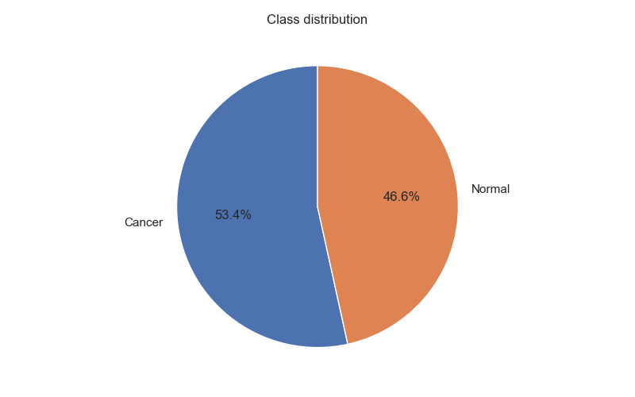
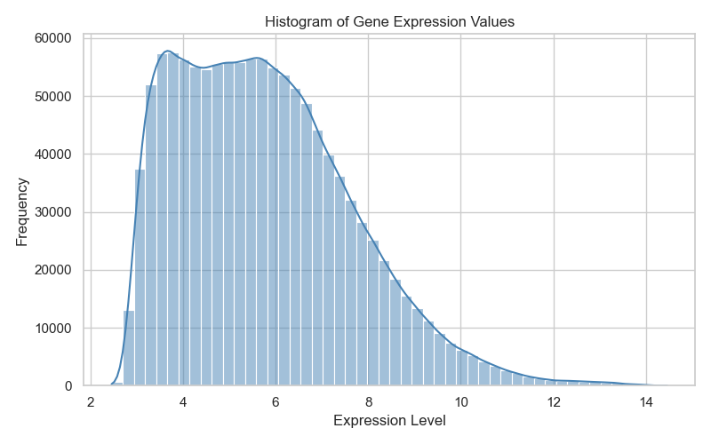
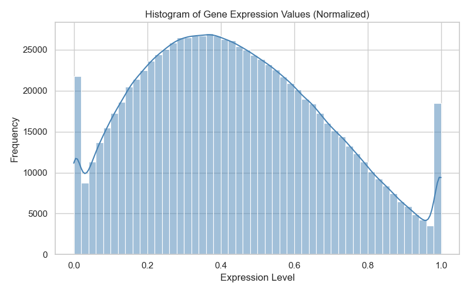
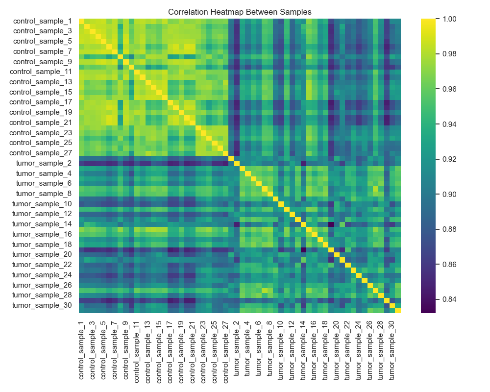
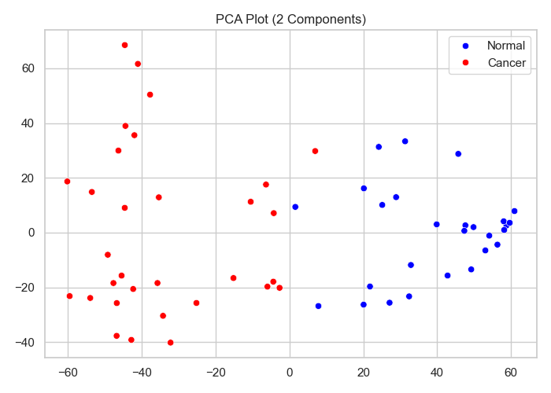
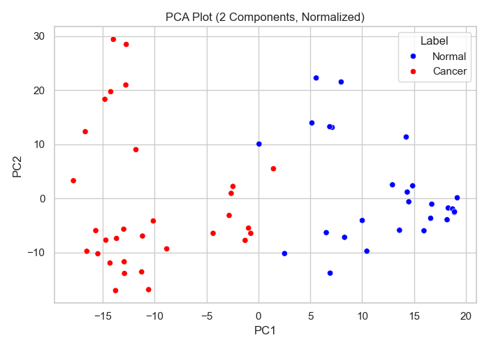
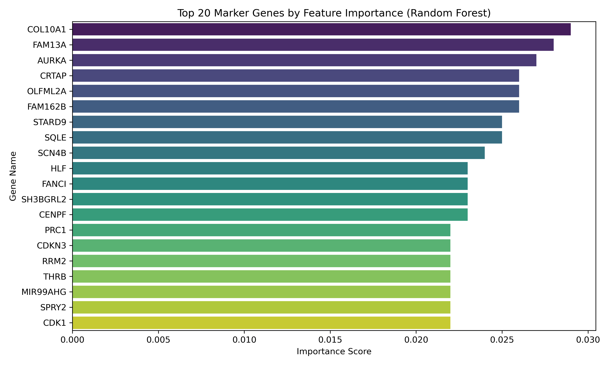
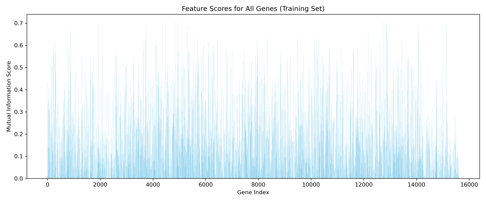
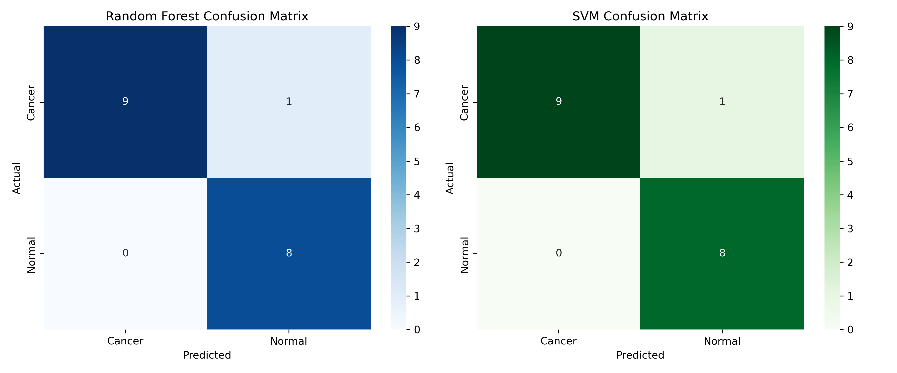
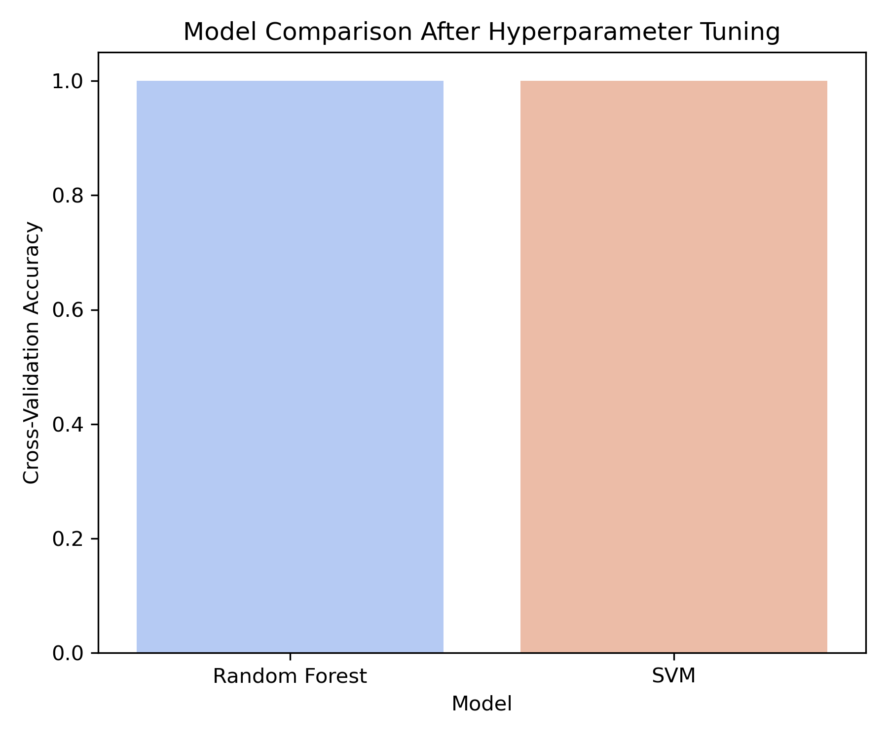

#  Machine Learning-Based Analysis of Gene Expression Profiles in Breast Cancer

🔍 **GEO Dataset: [GSE10810](https://www.ncbi.nlm.nih.gov/geo/query/acc.cgi?acc=GSE10810)**  
👨‍🔬 **Conducted during and after the ABCON 2025 Workshop**  
📅 **Analysis completed on: October 8, 2025**  
📁 **Full details in [`analysis_report.md`](analysis_report.md)**

---

## 📚 Overview

This project performs a detailed, step-by-step machine learning analysis of **breast cancer gene expression data**. The workflow includes data preprocessing, normalization, feature selection, model training, evaluation, and hyperparameter tuning to identify potential biomarker genes and build predictive classifiers.

The analysis pipeline ensures **reproducibility** and **biological relevance**, highlighting genes that distinguish breast cancer tissue from normal breast tissue.

## 📑 Table of Contents

- [Overview](#-overview)
- [Objectives](#-objectives)
- [Dataset Summary](#-dataset-summary)
- [Key Analysis Steps](#-key-analysis-steps)
- [Biological Insights](#-biological-insights)
- [Project Structure](#-project-structure)
- [Highlighted Outputs](#-highlighted-outputs)
- [Interactive HTML Reports](#-interactive-html-reports)
- [Selected Results (Preview)](#-selected-results-preview)
- [Reproducibility](#-reproducibility)
- [Acknowledgment](#-acknowledgment)
- [Author Contribution](#-author-contribution)
- [Citation & Usage](#-Citation--Usage)
- [License](#-License)

## 🎯 Objectives

- Preprocess and normalize breast cancer gene expression datasets.
- Identify top informative genes for classification.
- Build and evaluate machine learning models (Random Forest, SVM) for cancer vs. normal tissue prediction.
- Perform feature selection and identify potential biomarker genes.

---


## 🧪 Dataset Summary

| Feature       | Description                                                                             |
| ------------- | --------------------------------------------------------------------------------------- |
| Organism      | *Homo sapiens*                                                                          |
| Samples       | 58 breast tissue samples (31 cancer, 27 normal)                                         |
| Data Type     | Gene expression (microarray, cleaned and normalized)                                    |
| Platform      | Affymetrix Human Genome U133 Plus 2.0 Array                                             |
| GEO Accession | [GSE10810](https://www.ncbi.nlm.nih.gov/geo/query/acc.cgi?acc=GSE10810)                 |
| Publication   | Pedraza V. et al., 2010 • DOI: [10.1002/cncr.24805](https://doi.org/10.1002/cncr.24805) |

---

## 🧠 Key Analysis Steps

> All implemented in modular Jupyter Notebooks and exported to HTML with figures and outputs.

| Notebook | Description |
|----------|-------------|
| `0` | Load required Python libraries and confirm environment setup |
| `1` | Data exploration & cleaning: statistical summaries, visualization, PCA |
| `2` | Preprocessing & normalization: IQR-based filtering, MinMax scaling, PCA visualization |
| `3` | Feature selection: Mutual Information-based selection of top 50 genes |
| `4` | Model building & evaluation: Random Forest and SVM training, confusion matrices, top marker genes identification |
| `5` | Cross-validation & hyperparameter tuning: GridSearchCV with 5-fold CV for optimized model parameters |

---

## 📈 Biological Insights

- Identified **top 50 informative genes** that distinguish breast cancer from normal tissue.
- Random Forest and SVM classifiers achieved **94% accuracy** on the test set.
- Top marker genes include **CD300LG, ANLN, CRTAP, MOCS1, PTCH1**, which are known to be involved in cancer biology.
- Cross-validation and hyperparameter tuning confirmed model stability and high predictive performance.
- Results provide potential biomarker candidates for further biological validation.

---

## 📂 Project Structure

```

Machine-Learning-Based-Analysis-Of-Gene-Expression-In-Breast-Cancer
│
├── data                       # Input datasets
│   └── GSE10810_Expression_Matrix_cleaned.xls
│
├── scripts                    # Jupyter Notebooks for each analysis step
│   ├── Notebook_0_Load_Libraries.ipynb
│   ├── Notebook_1_Data_Exploration_and_Cleaning.ipynb
│   ├── Notebook_2_Preprocessing_Normalization.ipynb
│   ├── Notebook_3_Feature_Selection.ipynb
│   ├── Notebook_4_Model_Building_Evaluation.ipynb
│   └── Notebook_5_CrossValidation_Hyperparameter_Tuning.ipynb
│
├── results                    # Processed results and outputs
│   ├── X_test_selected.pkl
│   ├── X_train_selected.pkl
│   ├── y_test.pkl
│   ├── y_train.pkl
│   ├── best_RF_model.pkl
│   ├── best_SVM_model.pkl
│   ├── selected_gene_names.pkl
│   ├── selected_genes_top50.xls
│   ├── top_20_marker_genes.xls
│   ├── cv_model_performance_summary.xls
│   ├── data_cleaned_with_labels.xls
│   ├── data_normalized_minmax.xls
│   └── pca_normalized_coordinates.xls
│
├── figures                    # Visual outputs and plots
│   ├── boxplot_comparison.png
│   ├── histogram_distribution.png
│   ├── correlation_heatmap.png
│   ├── pca_plot.png
│   ├── class_distribution_pie.png
│   ├── histogram_distribution_normalized.png
│   ├── pca_plot_normalized.png
│   ├── feature_scores_barplot.png
│   ├── confusion_matrices.png
│   ├── top_20_marker_genes.png
│   └── model_comparison_cv.png
│
├── docs                       # HTML exports of notebooks
│   ├── Notebook_0_Load_Libraries.html
│   ├── Notebook_1_Data_Exploration_and_Cleaning.html
│   ├── Notebook_2_Preprocessing_Normalization.html
│   ├── Notebook_3_Feature_Selection.html
│   ├── Notebook_4_Model_Building_Evaluation.html
│   └── Notebook_5_CrossValidation_Hyperparameter_Tuning.html
│
├── analysis_report.md          # Full explanation of analysis steps and results
└── README.md                   # Project summary and guidance

```
 

---


## 📌 Highlighted Outputs

| Output Type | File |
|-------------|------|
| Cleaned Expression Data | `GSE10810_Expression_Matrix_cleaned.csv` |
| Filtered Genes (IQR-based) | `data_filtered_iqr.xls` |
| Normalized Expression | `data_normalized_minmax.xls` |
| PCA Coordinates | `pca_normalized_coordinates.xls` |
| Selected Genes | `selected_genes_top50.csv` |
| Top 20 Marker Genes | `top_20_marker_genes.csv` |
| Model Performance Summary | `cv_model_performance_summary.csv` |

---

## 📢 Interactive HTML Reports

This project includes **interactive HTML versions** of all Jupyter notebooks, allowing easy exploration of the analysis workflow and outputs.

* Each HTML report contains **formatted text, tables, figures, and code outputs** for reproducibility.
* When viewed directly in GitHub, the `.html` files may appear as **raw HTML code**.
* To view formatted reports, open the links below or download and open them in your **local browser**.

### 📎 View live HTML reports here:

👉 [https://mohamed-h-hussein.github.io/Machine-Learning-Based-Analysis-Of-Gene-Expression-In-Breast-Cancer/](https://mohamed-h-hussein.github.io/Machine-Learning-Based-Analysis-Of-Gene-Expression-In-Breast-Cancer/)
### Available HTML Reports:

| Step | Notebook | HTML File |
|------|-----------|-----------|
| 00 | Load Libraries | [Notebook_0_Load_Libraries.html](https://mohamed-h-hussein.github.io/Machine-Learning-Based-Analysis-Of-Gene-Expression-In-Breast-Cancer/Notebook_0_Load_Libraries.html) |
| 01 | Data Exploration and Cleaning | [Notebook_1_Data_Exploration_and_Cleaning.html](https://mohamed-h-hussein.github.io/Machine-Learning-Based-Analysis-Of-Gene-Expression-In-Breast-Cancer/Notebook_1_Data_Exploration_and_Cleaning.html)|
| 02 | Preprocessing and Normalization | [Notebook_2_Preprocessing_Normalization.html](https://mohamed-h-hussein.github.io/Machine-Learning-Based-Analysis-Of-Gene-Expression-In-Breast-Cancer/Notebook_2_Preprocessing_Normalization.html)|
| 03 | Feature Selection | [Notebook_3_Feature_Selection.html](https://mohamed-h-hussein.github.io/Machine-Learning-Based-Analysis-Of-Gene-Expression-In-Breast-Cancer/Notebook_3_Feature_Selection.html) |
| 04 | Model Building and Evaluation | [Notebook_4_Model_Building_Evaluation.html](https://mohamed-h-hussein.github.io/Machine-Learning-Based-Analysis-Of-Gene-Expression-In-Breast-Cancer/Notebook_4_Model_Building_Evaluation.html) |
| 05 | Cross-Validation and Hyperparameter Tuning | [Notebook_5_CrossValidation_Hyperparameter_Tuning.html](https://mohamed-h-hussein.github.io/Machine-Learning-Based-Analysis-Of-Gene-Expression-In-Breast-Cancer/Notebook_5_CrossValidation_Hyperparameter_Tuning.html) |

Use these HTML reports to explore the analysis interactively and review detailed results.

---

## 🖼️ Selected Results (Preview)

### 1️⃣ Class Distribution in the Dataset
Understanding the balance between tumor and normal samples.



---

### 2️⃣ Gene Expression Distribution (Raw vs Normalized)
Before and after preprocessing — illustrating data normalization effects.

| Raw Data | Normalized Data |
|-----------|----------------|
|  |  |

---

### 3️⃣ Correlation Heatmap of Gene Features
Shows pairwise relationships among top genes.



---

### 4️⃣ PCA Visualization
Visualizes clustering patterns before and after normalization.

| PCA (Raw Data) | PCA (Normalized) |
|----------------|------------------|
|  |  |

---

### 5️⃣ Top 20 Marker Genes
Displays the most informative genes selected for classification.



---

### 6️⃣ Feature Scores (Machine Learning Importance)
Highlights gene features contributing most to model prediction.



---

### 7️⃣ Confusion Matrices
Evaluates model performance on training and test sets.



---

### 8️⃣ Model Performance and Cross-Validation Results
Comparative performance of classifiers (Accuracy, F1-score, AUC) with k-fold validation.

| Model Comparison | 
|------------------|
|  

---

> These visualizations summarize the **machine learning workflow** — from raw data exploration to model validation — providing a clear overview of feature importance, performance, and reproducibility.


---


## 🔁 Reproducible Analysis Workflow (Jupyter Notebooks)

All analytical steps were performed in **six modular Jupyter notebooks**, each focusing on a specific phase of the pipeline.
They can be run sequentially or individually to inspect intermediate results, figures, and trained models.

| Step | Notebook | Description |
|------|-----------|-------------|
| 00 | [Notebook_0_Load_Libraries.ipynb](scripts/Notebook_0_Load_Libraries.ipynb) | Import dependencies and initialize the environment |
| 01 | [Notebook_1_Data_Exploration_and_Cleaning.ipynb](scripts/Notebook_1_Data_Exploration_and_Cleaning.ipynb) | Explore raw data, handle missing values, and detect outliers |
| 02 | [Notebook_2_Preprocessing_Normalization.ipynb](scripts/Notebook_2_Preprocessing_Normalization.ipynb) | Perform feature scaling, normalization, and encoding |
| 03 | [Notebook_3_Feature_Selection.ipynb](Notebook_3_Feature_Selection.ipynb) | Select the most informative genes using variance and correlation filters |
| 04 | [Notebook_4_Model_Building_Evaluation.ipynb](scripts/Notebook_4_Model_Building_Evaluation.ipynb) | Train ML classifiers (SVM, RF, LR) and evaluate model performance |
| 05 | [Notebook_5_CrossValidation_Hyperparameter_Tuning.ipynb](scripts/Notebook_5_CrossValidation_Hyperparameter_Tuning.ipynb) | Apply k-fold cross-validation and tune hyperparameters for best accuracy |

To export any notebook as HTML for interactive viewing:

```
!jupyter nbconvert --to html --embed-images "Notebook_4_Model_Building_Evaluation.ipynb" --output "Notebook_4_Model_Building_Evaluation.html"
````

> All output tables are stored in the `results/` directory, and visualizations are available in the `figures/` folder, both embedded within the HTML reports for easy interpretation.


---

## 🌟 Acknowledgment

This project was developed as part of the **ABCON 2025 Workshop**, during and after the session:
**“Machine Learning in Biomedical Research: From Data to Diagnosis”**

We gratefully acknowledge the invaluable guidance and instruction provided by:

* **Dr. Eman Badr**
  Associate Professor, Director of the Computational Biology and Bioinformatics Unit,
  Zewail City of Science and Technology

* **Ms. Shrooq Badwy**
  Research and Teaching Assistant, Bioinformatics Center,
  Helwan University in Cairo 
  
* **Ms. Manar Samir**
  M.Sc. Candidate, Computational and Bioinformatics Lab,
  Zewail City of Science and Technology


Their session and original analysis notebook provided the foundation for this project.
The original single Jupyter Notebook was **restructured, expanded, and refined** by the participant into a **complete multi-step workflow**.

It was divided into **six modular notebooks**, each dedicated to a specific analytical task — from **data preprocessing and feature engineering** to **model training, evaluation and visualization**.
Additional figures, metrics, and validation steps were incorporated to enhance the **scientific depth, clarity and reproducibility** of the analysis.

The entire workflow was then **independently executed, documented, and organized** into a reproducible folder structure with **scripts, figures, and HTML reports**, and finally **published on GitHub** for open access and future reuse .

---

## 🧑‍🔬 Author Contribution

All analytical steps — from **data preprocessing** and **feature selection** to **model training**, **evaluation**, and **visualization** — were independently executed by:

**Mohamed H. Hussein**
*M.Sc. Candidate in Biochemistry and Molecular Biology focusing on Molecular Cancer Biology & Bioinformatics*
**Ain Shams University, Faculty of Science**

The **original single analysis notebook** was **restructured, modularized, and extended** into a complete workflow composed of 6 Jupyter Notebooks.

Each notebook focuses on a distinct stage of the machine learning analysis pipeline, including:

1. **Environment setup and library loading** – initializing dependencies and preparing the analysis workspace.
2. **Data exploration and cleaning** – inspecting dataset structure, handling missing values, and detecting outliers.
3. **Preprocessing and normalization** – scaling, transforming, and encoding features for modeling readiness.
4. **Feature selection** – identifying informative genes and reducing data dimensionality.
5. **Model building and evaluation** – training machine learning models (SVM, Random Forest) and assessing their performance.
6. **Cross-validation and hyperparameter tuning** – optimizing model accuracy and robustness through systematic parameter search.


> All notebooks collectively form a complete, reproducible workflow from raw data exploration to optimized model deployment.

All outputs, visualizations, and metrics were **generated, interpreted, and documented** by the author in a **fully reproducible folder structure**, designed to promote **transparency, reproducibility, and learning** for future research use.


---

## 📝 Citation & Usage

This project is open-source and provided for educational and academic purposes.

If you reuse, adapt, or build upon this work, please cite:

* The original GEO dataset: **GSE10810**
* The ABCON 2025 Workshop titled: **Machine Learning in Biomedical Research: From Data to Diagnosis"**
* The author and repository to acknowledge the analysis contributions:

**Hussein, Mohamed H. (2025).** *Machine Learning-Based Analysis of Gene Expression Profiles in Breast Cancer* [Data analysis workflow]. GitHub repository.
🔗 [https://github.com/Mohamed-H-Hussein/Machine-Learning-Based-Analysis-of-Gene-Expression-Profiles-in-Breast-Cancer](https://github.com/Mohamed-H-Hussein/Machine-Learning-Based-Analysis-of-Gene-Expression-Profiles-in-Breast-Cancer)

Proper citation supports transparency, credit to contributors and reproducible science.

---

## 📜 License
[](https://opensource.org/licenses/MIT)  
This repository is licensed under the MIT License.  
See the full license details: [https://opensource.org/licenses/MIT](https://opensource.org/licenses/MIT)


---

© 2025 Mohamed H. Hussein. The software is provided "as is" without warranty of any kind.
